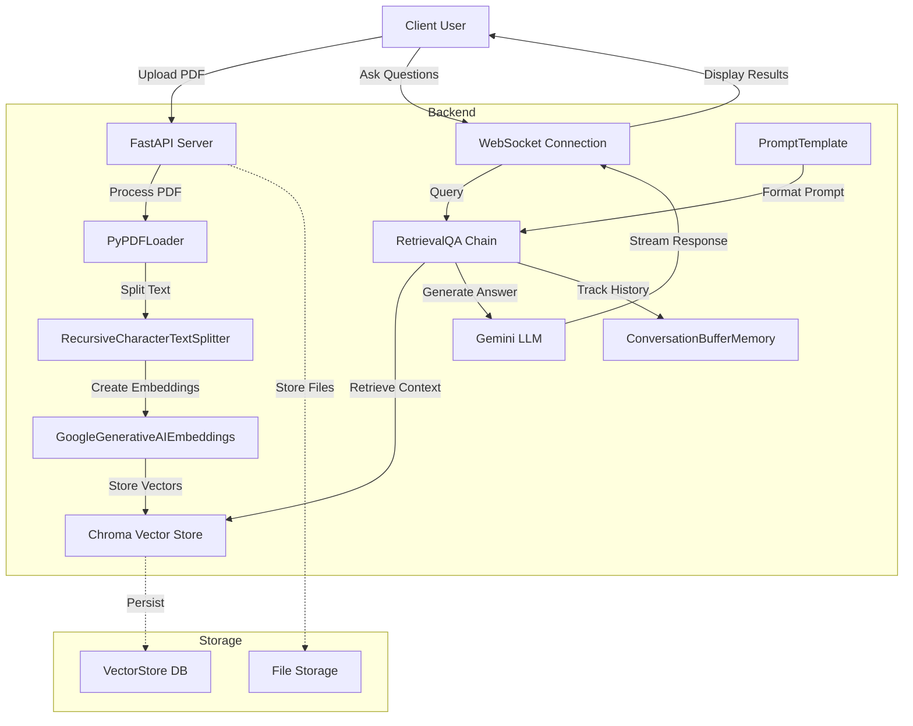

# PDF Chatbot - FastAPI Application with LangChain Integration

This repository contains a FastAPI application integrated with LangChain for question answering and document retrieval. The application allows uploading PDF files, extracting text, and querying for answers based on user input.

## Features

- **Upload PDF**: Upload PDF files to the server, which are processed and stored in a vector store.
- **WebSocket Chat**: Real-time question answering using a WebSocket endpoint.
- **Document Retrieval**: Retrieve source documents related to the answered questions.
- **Memory Integration**: Uses conversation history to improve response relevance.

### Architecture Diagram


## Setup Instructions

To run this application locally, follow these steps:

### Prerequisites

- Python 3.10+
- Install dependencies using `pip install -r requirements.txt`

### Running the Application

1. Clone the repository:

   ```bash
   git clone <repository-url>
   cd <repository-folder>
   ```

2. Install dependencies:

   ```bash
   pip install -r requirements.txt
   ```

3. Start the FastAPI server:

   ```bash
   uvicorn main:app --host 0.0.0.0 --port 8000
   ```

4. Access the API at `http://localhost:8000` in your web browser.

### Endpoints

- **GET /get_documents/**: Retrieve a list of uploaded documents.
- **POST /upload_pdf/**: Upload a PDF file for processing.
- **WebSocket /ws/chat**: WebSocket endpoint for real-time question answering.

### Example Usage

1. Upload a PDF file using `/upload_pdf/` endpoint.
2. Connect to `/ws/chat` WebSocket endpoint using a WebSocket client.
3. Send a text message to ask a question and receive real-time answers.

## Technologies Used

- **FastAPI**: Web framework for building APIs with Python 3.7+.
- **LangChain**: Library for NLP tasks including question answering and document retrieval.
- **Chroma Vector Store**: Persistent storage for document embeddings.
- **PyPDF2**: Library for PDF file manipulation.


## License

This project is licensed under the MIT License - see the [](https://opensource.org/licenses/MIT) file for details.
